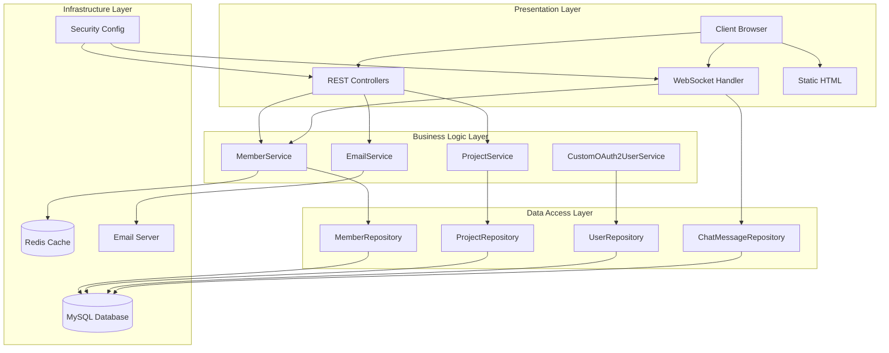
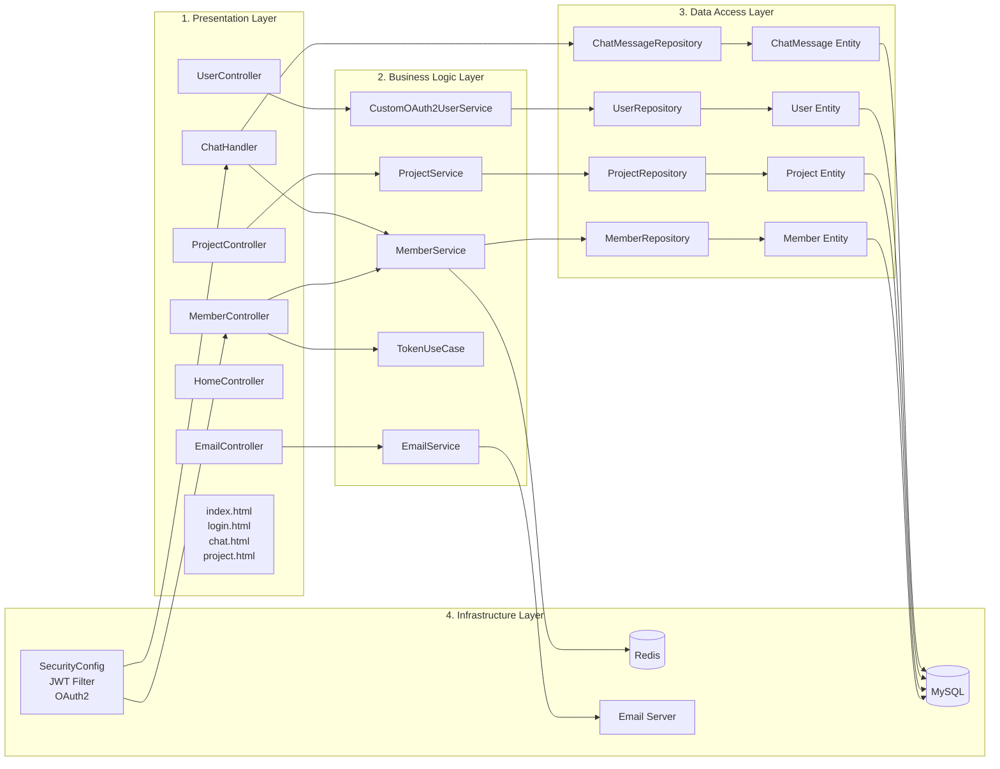
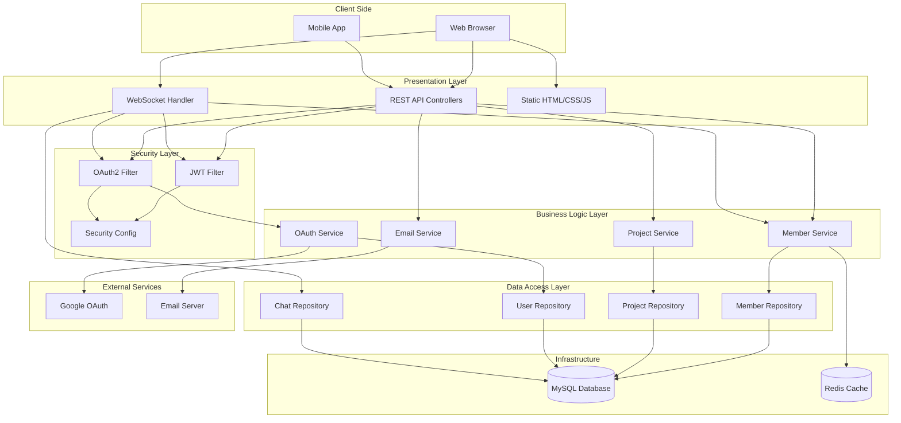

# Devit 프로젝트 아키텍처 문서

## 목차
1. [시스템 개요](#시스템-개요)
2. [기술 스택](#기술-스택)
3. [아키텍처 개요](#아키텍처-개요)
4. [레이어 구조](#레이어-구조)
5. [주요 컴포넌트](#주요-컴포넌트)
6. [데이터 흐름](#데이터-흐름)
7. [보안 아키텍처](#보안-아키텍처)
8. [인프라 구조](#인프라-구조)

---

## 시스템 개요

**Devit**은 실시간 협업 플랫폼으로, WebSocket 기반 실시간 채팅과 프로젝트 관리 기능을 제공하는 Spring Boot 기반 애플리케이션입니다.

### 주요 기능
- 실시간 양방향 채팅 (WebSocket)
- 사용자 인증 및 인가 (JWT, OAuth2)
- 프로젝트 관리
- 이메일 인증
- RESTful API

---

## 기술 스택

### Backend
- **Framework**: Spring Boot 3.2.5
- **Language**: Java 17
- **Build Tool**: Gradle
- **WebSocket**: Spring WebSocket
- **Security**: Spring Security + JWT + OAuth2 (Google)

### Database
- **RDBMS**: MySQL 8.0
- **ORM**: Spring Data JPA (Hibernate)
- **Cache**: Redis (선택적)

### 기타
- **API Documentation**: Swagger (SpringDoc OpenAPI)
- **Email**: Spring Mail
- **Template Engine**: Thymeleaf (사용 중단, Static HTML 사용)

---

## 아키텍처 개요

### 아키텍처 패턴
- **레이어드 아키텍처 (Layered Architecture)**
- **도메인 주도 설계 (DDD) 기반 패키지 구조**

### 레이어 구조 다이어그램 (Mermaid)



### 레이어 구조 다이어그램 (상세)



### 전체 시스템 아키텍처 다이어그램



---

## 레이어 구조

### 1. Presentation Layer (프레젠테이션 레이어)

#### REST Controllers
- `MemberController`: 회원가입, 로그인, 테스트 API
- `EmailController`: 이메일 인증 API
- `ProjectController`: 프로젝트 CRUD API
- `UserController`: OAuth 사용자 정보 API
- `HomeController`: 로그인 페이지 컨트롤러

#### WebSocket Handler
- `ChatHandler`: 실시간 채팅 메시지 처리
  - 메시지 수신/발신
  - 세션 관리
  - 채팅 히스토리 로딩

#### Static Resources
- `index.html`: 메인 페이지 (OAuth 로그인 포함)
- `login.html`: 로그인 페이지
- `signup.html`: 회원가입 페이지
- `chat.html`: 채팅 페이지
- `project.html`: 프로젝트 관리 페이지

### 2. Business Logic Layer (비즈니스 로직 레이어)

#### Member Domain
- `MemberService`: 회원 관리 서비스
  - 회원가입
  - 로그인 (JWT 토큰 발급)
  - 로그아웃
- `TokenUseCase`: 토큰 관리 유스케이스
  - 토큰 생성
  - 토큰 재생성
- `EmailService`: 이메일 인증 서비스

#### OAuth Domain
- `CustomOAuth2UserService`: OAuth2 사용자 정보 처리
  - Google OAuth 로그인 처리
  - 사용자 정보 저장/업데이트

#### Project Domain
- `ProjectService`: 프로젝트 관리 서비스
  - 프로젝트 생성
  - 프로젝트 조회
  - 프로젝트 수정/삭제

### 3. Data Access Layer (데이터 접근 레이어)

#### Repositories
- `MemberRepository`: 회원 데이터 접근
- `UserRepository`: OAuth 사용자 데이터 접근
- `ProjectRepository`: 프로젝트 데이터 접근
- `ChatMessageRepository`: 채팅 메시지 데이터 접근

#### Entities
- `Member`: 회원 엔티티
- `User`: OAuth 사용자 엔티티
- `Project`: 프로젝트 엔티티
- `ChatMessage`: 채팅 메시지 엔티티

### 4. Global Layer (전역 레이어)

#### Configuration
- `SecurityConfig`: Spring Security 설정
  - JWT 필터 설정
  - OAuth2 로그인 설정
  - CORS 설정
  - 세션 관리
- `WebSocketConfig`: WebSocket 설정
- `JacksonConfig`: JSON 직렬화 설정
- `RedisConfig`: Redis 설정 (선택적)
- `EmailConfig`: 이메일 설정 (선택적)
- `SwaggerConfig`: API 문서 설정

#### Security
- `JwtProvider`: JWT 토큰 생성/검증
- `JwtAuthenticationFilter`: JWT 인증 필터
- `MemberDetails`: 사용자 상세 정보
- `MemberDetailsService`: 사용자 정보 로드 서비스

#### Exception Handling
- `CustomException`: 커스텀 예외
- `CustomExceptionHandler`: 전역 예외 처리
- `ErrorResponseEntity`: 에러 응답 엔티티

#### DTO
- `ApiResponse`: 공통 API 응답 형식

---

## 주요 컴포넌트

### 1. 인증 및 인가 시스템

```
┌─────────────┐
│   Client    │
└──────┬──────┘
       │
       │ 1. OAuth2 Login Request
       ↓
┌──────────────────────────────────┐
│   OAuth2SuccessHandler           │
│   - OAuth 로그인 성공 처리        │
│   - 세션 생성                     │
└──────────────────────────────────┘
       │
       │ 2. User Info
       ↓
┌──────────────────────────────────┐
│   CustomOAuth2UserService        │
│   - 사용자 정보 저장/업데이트      │
└──────────────────────────────────┘

또는

┌─────────────┐
│   Client    │
└──────┬──────┘
       │
       │ 1. Login Request
       ↓
┌──────────────────────────────────┐
│   MemberController               │
│   /auth/signin                   │
└──────────────────────────────────┘
       │
       │ 2. Authentication
       ↓
┌──────────────────────────────────┐
│   MemberService                  │
│   - 비밀번호 검증                 │
│   - JWT 토큰 발급                 │
└──────────────────────────────────┘
       │
       │ 3. JWT Token
       ↓
┌──────────────────────────────────┐
│   JwtAuthenticationFilter        │
│   - 토큰 검증                     │
│   - SecurityContext 설정          │
└──────────────────────────────────┘
```

### 2. WebSocket 채팅 시스템

```
┌─────────────┐
│   Client    │
└──────┬──────┘
       │
       │ WebSocket Connection
       ↓
┌──────────────────────────────────┐
│   WebSocketConfig                │
│   - 엔드포인트 등록               │
│   - 핸들러 등록                   │
└──────────────────────────────────┘
       │
       │ Message
       ↓
┌──────────────────────────────────┐
│   ChatHandler                    │
│   - 메시지 수신                   │
│   - 메시지 저장 (DB)              │
│   - 브로드캐스트                   │
│   - 히스토리 로딩                 │
└──────────────────────────────────┘
       │
       │ Save to DB
       ↓
┌──────────────────────────────────┐
│   ChatMessageRepository          │
│   - JPA를 통한 데이터 저장         │
└──────────────────────────────────┘
```

### 3. 프로젝트 관리 시스템

```
┌─────────────┐
│   Client    │
└──────┬──────┘
       │
       │ REST API Request
       ↓
┌──────────────────────────────────┐
│   ProjectController              │
│   - GET /api/projects            │
│   - POST /api/projects           │
│   - PUT /api/projects/{id}       │
│   - DELETE /api/projects/{id}    │
└──────────────────────────────────┘
       │
       │ Business Logic
       ↓
┌──────────────────────────────────┐
│   ProjectService                  │
│   - 프로젝트 생성/수정/삭제        │
└──────────────────────────────────┘
       │
       │ Data Access
       ↓
┌──────────────────────────────────┐
│   ProjectRepository              │
│   - JPA를 통한 데이터 접근         │
└──────────────────────────────────┘
```

---

## 데이터 흐름

### 1. 회원가입 흐름

```
Client → MemberController.signUp()
       → MemberService.signUp()
       → MemberRepository.save()
       → MySQL Database
```

### 2. 로그인 흐름 (JWT)

```
Client → MemberController.signIn()
       → MemberService.signIn()
       → MemberRepository.findByUsername()
       → Password 검증
       → JwtProvider.generateToken()
       → JWT Token 반환
```

### 3. 로그인 흐름 (OAuth2)

```
Client → /oauth2/authorization/google
       → Google OAuth 서버
       → OAuth2SuccessHandler
       → CustomOAuth2UserService
       → UserRepository.saveOrUpdate()
       → MySQL Database
       → 세션 생성
       → 메인 페이지 리다이렉트
```

### 4. 채팅 메시지 흐름

```
Client → WebSocket Connection
       → ChatHandler.handleMessage()
       → ChatMessageRepository.save()
       → MySQL Database
       → ChatHandler.broadcast()
       → 모든 연결된 클라이언트에게 전송
```

---

## 보안 아키텍처

### 보안 계층 구조

```
┌─────────────────────────────────────┐
│   Security Filter Chain             │
├─────────────────────────────────────┤
│ 1. CORS Filter                      │
│ 2. Logout Filter                    │
│ 3. OAuth2 Authorization Filter      │
│ 4. OAuth2 Login Filter              │
│ 5. JWT Authentication Filter        │
│ 6. Security Context Filter          │
│ 7. Authorization Filter             │
└─────────────────────────────────────┘
```

### 인증 방식

1. **JWT 기반 인증**
   - 로그인 시 JWT 토큰 발급
   - 요청 헤더에 `Authorization: Bearer <token>` 포함
   - `JwtAuthenticationFilter`에서 토큰 검증

2. **OAuth2 기반 인증**
   - Google OAuth2 로그인
   - 세션 기반 인증 (SessionCreationPolicy.IF_REQUIRED)
   - OAuth2User 정보를 SecurityContext에 저장

### 인가 규칙

```java
// SecurityConfig.java
- 공개 엔드포인트: /, /static/**, /auth/**, /*.html, /ws/**
- OAuth 엔드포인트: /oauth2/**
- 인증 필요: /api/users/me (현재는 permitAll)
- 나머지: 임시로 permitAll (개발용)
```

---

## 인프라 구조

### 현재 구조 (로컬)

```
┌─────────────────┐
│  Spring Boot    │
│  Application    │
│  (Port 8080)    │
└────────┬────────┘
         │
    ┌────┴────┐
    │         │
    ↓         ↓
┌────────┐ ┌────────┐
│ MySQL  │ │ Redis  │
│ (3306) │ │ (6379) │
│        │ │(선택적)│
└────────┘ └────────┘
```

### AWS 배포 예상 구조

```
┌─────────────────────────────────┐
│   AWS Elastic Beanstalk         │
│   또는 EC2                       │
│                                 │
│  ┌───────────────────────────┐  │
│  │  Spring Boot Application  │  │
│  │  (Port 8080 or 80)       │  │
│  └───────────────────────────┘  │
└─────────────────────────────────┘
         │                    │
         │                    │
    ┌────┴────┐          ┌────┴────┐
    │         │          │         │
    ↓         ↓          ↓         ↓
┌────────┐ ┌────────┐ ┌────────┐ ┌────────┐
│  RDS   │ │  ElastiCache│ │  S3   │ │  SES   │
│  MySQL │ │  Redis │ │  Static│ │  Email │
└────────┘ └────────┘ └────────┘ └────────┘
```

---

## 데이터베이스 스키마

### 주요 테이블

1. **member**
   - id (PK)
   - username
   - email
   - password (BCrypt 암호화)
   - role
   - credit
   - created_at

2. **users** (OAuth 사용자)
   - id (PK)
   - email
   - name
   - picture
   - provider

3. **project**
   - project_id (PK)
   - title
   - content
   - major (Enum: BACKEND, FRONTEND, WEB, APP, GAME)

4. **chat_message**
   - id (PK)
   - sender
   - content
   - type (Enum: TALK, ENTER, LEAVE)
   - timestamp

---

## API 엔드포인트

### 인증 관련
- `POST /auth/signup` - 회원가입
- `POST /auth/signin` - 로그인 (JWT)
- `GET /auth/test` - 테스트 엔드포인트
- `GET /oauth2/authorization/google` - Google OAuth 로그인
- `GET /api/users/me` - 현재 사용자 정보 조회

### 프로젝트 관련
- `GET /api/projects` - 프로젝트 목록 조회
- `POST /api/projects` - 프로젝트 생성
- `PUT /api/projects/{id}` - 프로젝트 수정
- `DELETE /api/projects/{id}` - 프로젝트 삭제

### WebSocket
- `ws://localhost:8080/ws/chat` - 채팅 WebSocket 엔드포인트

---

## 설정 파일

### application.yml
- OAuth2 설정 (Google)
- 데이터소스 설정 (MySQL)
- JPA 설정

### application.properties
- 서버 포트 (8080)
- 데이터베이스 연결 정보
- JPA/Hibernate 설정
- Redis 설정 (선택적)
- 이메일 설정 (선택적)

---

## 향후 개선 사항

1. **환경 변수 분리**
   - 민감한 정보를 환경 변수로 분리
   - AWS Secrets Manager 활용

2. **로깅 시스템**
   - 구조화된 로깅 (Logback, Log4j2)
   - CloudWatch 연동

3. **모니터링**
   - 애플리케이션 성능 모니터링 (APM)
   - 헬스 체크 엔드포인트

4. **CI/CD 파이프라인**
   - GitHub Actions
   - 자동 배포

5. **캐싱 전략**
   - Redis를 활용한 캐싱 활성화
   - 세션 저장소로 Redis 활용

---

## 참고 문서

- [Spring Boot 공식 문서](https://spring.io/projects/spring-boot)
- [Spring Security 공식 문서](https://spring.io/projects/spring-security)
- [WebSocket API 문서](https://spring.io/guides/gs/messaging-stomp-websocket/)
- [AWS Elastic Beanstalk 문서](https://docs.aws.amazon.com/elasticbeanstalk/)

---

**작성일**: 2025-11-04  
**버전**: 1.0.0

